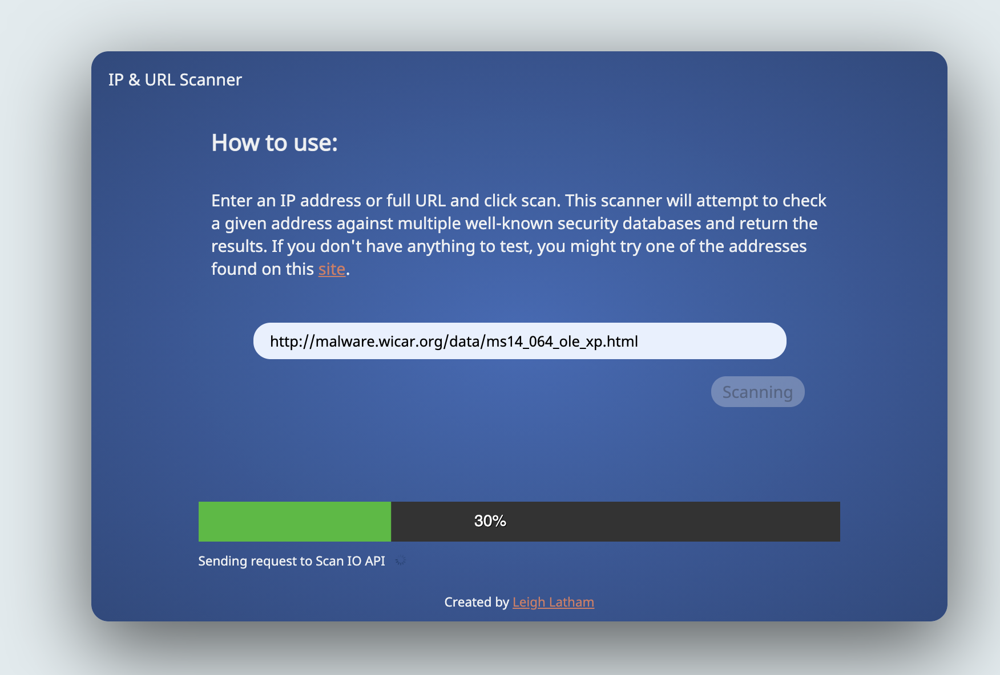
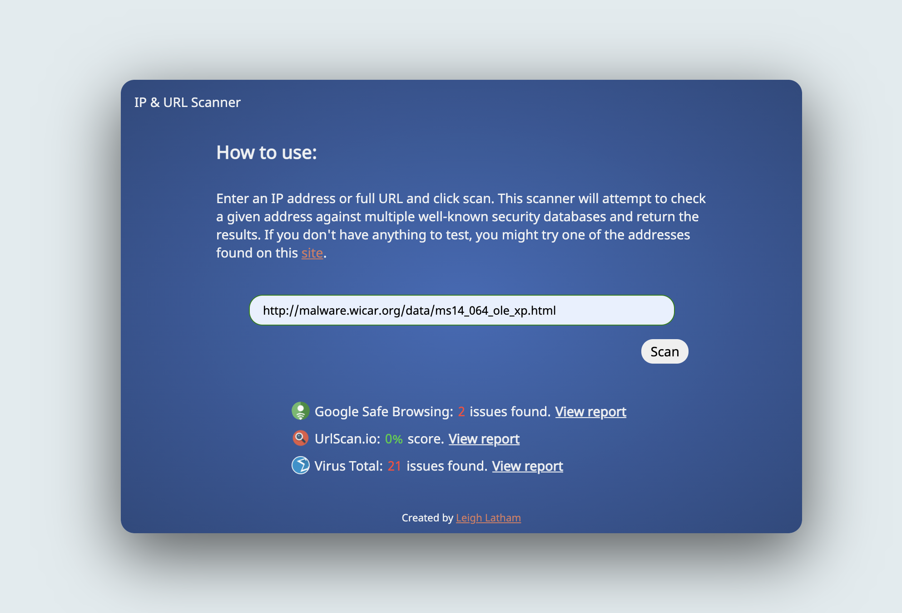

# Malicious IP/URL Scaner

## Just a passion project i built to test some free APIs from here: https://github.com/public-apis/public-apis#anti-malware

### Concept

The scanner uses three different API endpoints to check a given address (URL/IP) for malicious conntent.

If you want to use this yourself, you'll need free API keys generated from the following three websites

* https://urlscan.io/
* https://developers.google.com/safe-browsing
* https://developers.virustotal.com/v3.0/reference

Once you have registered and obtained your keys, you'll need to add them to a newly created .env file within the root of the project on your local system.

### Todo

* Add MongoDB for storing previosuly searched addresses
* Add better logging for failures
* Add option for emailing results
* Add option for exporting results to CSV
* Reinforce timeouts and rate limits to the free APIs
* Add web sockets so global searches appear instantly
* Add Elastic search for searching already submitted results

### Future

* Add Docker to improve ease of setup

